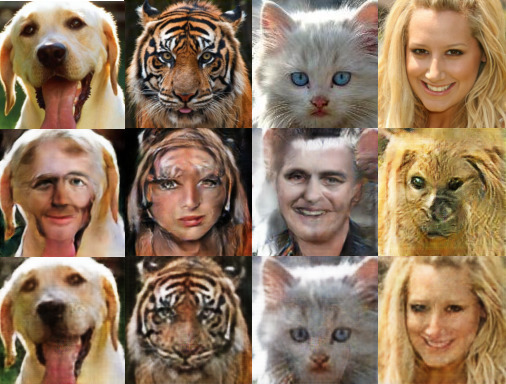

# Project 4 Generative Visual

Yunchieh Chang, cyunchie@ucsd.edu

## Abstract

Include your abstract here. This should be one paragraph clearly describing your concept, method, and results. This should tell us what architecture/approach you used. Also describe your creative goals, and whether you were successful in achieving them. Also could describe future directions.

In this project, we use a CycleGAN to learn to translate an image from a source domain, a face matching data set to a target domain, the animal faces data set in the absence of paired examples. It contains a generator network and a discriminator network beating each other while the generator takes a picture from the face matching data set tries to generate a realistic animal face image to trick the discriminator. Similarly, there's also another generator generate images in reverse direction to beat with the discriminator, which completes the so-called "Cycle"GAN.

Since the animal faces data set contains wide diversity of animal species, some of the results barely make sense and look vaguely. Therefore, an experiment of training a network to translate human faces to a certain kind of species, say, cat, is a future work direction. More details about our work is discussed in Section "Results".

## Model/Data

Briefly describe the files that are included with your repository:
- training data (or link to training data)
  * [Face matching data set](https://cyberextruder.com/face-matching-data-set-download/)
    * The data set contains 10,205 images of 1000 people scraped from the internet. 
    * All images have size 600 x 600 pixels and are stored with jpeg compression.

  * [Animal faces data set](http://www.stat.ucla.edu/~zzsi/HiT/exp5.html)
    * The data set contains 2461 images of 20 different species of animals. 

  * [Cat data set](https://www.kaggle.com/crawford/cat-dataset/downloads/cat-dataset.zip/2)
    * The data set contains over 9,000 cat images.

## Code

Your code for generating your project:
- Jupyter notebooks: humanToAnimal.ipynb

## Results

Documentation of your results in an appropriate format, both links to files and a brief description of their contents:
- image files (`.jpg`, `.png` or whatever else is appropriate)
  * Following we have presented some of our results in the order of the number of the parameter EPOCH
   * EPOCH = 34
     
     
   * EPOCH = 75
     
     
   * EPOCH = 76   
     
      
     
           
   * EPOCH = 79
              
   * EPOCH = 81
          
   * EPOCH = 86
             
   * EPOCH = 120
                
                   
   * EPOCH = 122
     
   * EPOCH = 123
        

## Technical Notes

Any implementation details or notes we need to repeat your work. 
- Does this code require other pip packages, software, etc?
- Does it run on some other (non-datahub) platform? (CoLab, etc.)

## Reference

References to any papers, techniques, repositories you used:
- Papers
  * [CycleGAN with Better Cycles](https://ssnl.github.io/better_cycles/report.pdf)

- Repositories
  * [pytorch-CycleGAN-and-pix2pix](https://github.com/junyanz/pytorch-CycleGAN-and-pix2pix)

- Blog posts
  * [Understanding and Implementing CycleGAN in TensorFlow](https://hardikbansal.github.io/CycleGANBlog/)
  * [Unpaired Image-to-Image Translation using Cycle-Consistent Adversarial Networks](https://junyanz.github.io/CycleGAN/)
